# Android智能下拉刷新框架-SmartRefreshLayout

[](https://www.apache.org/licenses/LICENSE-2.0)
[](https://android-arsenal.com/details/1/6001)
[ ](https://bintray.com/scwang90/maven/SmartRefreshLayout/_latestVersion) 
[](https://android-arsenal.com/api?level=12)
[](http://www.methodscount.com/?lib=com.scwang.smartrefresh%3ASmartRefreshLayout%3A1.0.2)

<!-- [](https://www.android.com) -->
<!-- [](https://github.com/scwang90) -->

## [English](README_EN.md) | 中文

正如名字所说，SmartRefreshLayout是一个“聪明”或者说“智能”的下拉刷新布局，由于它的“智能”，它不只是如其它的刷新布局所说的支持所有的View，还支持多层嵌套的视图结构。  除了“聪明”之外，SmartRefreshLayout还具备了很多的特点。  
它继承自ViewGroup 而不是其它的FrameLayout或者LinearLayout，提高了性能。  
它也吸取了现在流行的各种刷新布局的优点，包括谷歌官方的 SwipeRefreshLayout，现在非常流行的 [TwinklingRefreshLayout](https://github.com/lcodecorex/TwinklingRefreshLayout) 、[Ultra-Pull-To-Refresh](https://github.com/liaohuqiu/android-Ultra-Pull-To-Refresh)。还集成了各种炫酷的 Header 和 Footer。  
SmartRefreshLayout的目标是打造一个强大，稳定，成熟的下拉刷新框架，并集成各种的炫酷、多样、实用、美观的Header和Footer。

## 特点功能:

 - 支持所有的 View（AbsListView、RecyclerView、WebView....View） 和多层嵌套的视图结构
 - 支持自定义并且已经集成了很多炫酷的 Header 和 Footer （图）.
 - 支持和ListView的同步滚动 和 RecyclerView、AppBarLayout、CoordinatorLayout 的嵌套滚动 NestedScrolling.
 - 支持在Android Studio Xml 编辑器中预览 效果（图）
 - 支持分别在 Default（默认）、Xml、JavaCode 三个中设置 Header 和 Footer.
 - 支持自动刷新、自动上拉加载（自动检测列表惯性滚动到底部，而不用手动上拉）.
 - 支持通用的刷新监听器 OnRefreshListener 和更详细的滚动监听 OnMultiPurposeListener.
 - 支持自定义回弹动画的插值器，实现各种炫酷的动画效果.
 - 支持设置主题来适配任何场景的App，不会出现炫酷但很尴尬的情况.
 - 支持设置多种滑动方式来适配各种效果的Header和Footer：平移、拉伸、背后固定、顶层固定、全屏
 - 支持内容尺寸自适应 Content-wrap_content
 - 支持继承重写和扩展功能，内部实现没有 private 方法和字段，继承之后都可以重写覆盖
 - 支持越界回弹（Listview、RecyclerView、ScrollView、WebView...View）
 - 支持多点触摸，下拉、上拉各种手势冲突
 
## 传送门

 - [属性方法](art/md_property.md)
 - [智能之处](art/md_smart.md)
 - [常见问题](https://github.com/scwang90/SmartRefreshLayout/issues/71)
 - [更新日志](art/md_update.md)
 - [博客文章](https://segmentfault.com/a/1190000010066071) 
 - [源码下载](https://github.com/scwang90/SmartRefreshLayout/releases) 
 - [多点触摸](art/md_multitouch.md) 
 - [自定义Header](art/md_custom.md)
 
## Demo
[下载 APK-Demo](art/app-debug.apk)


#### 项目演示
 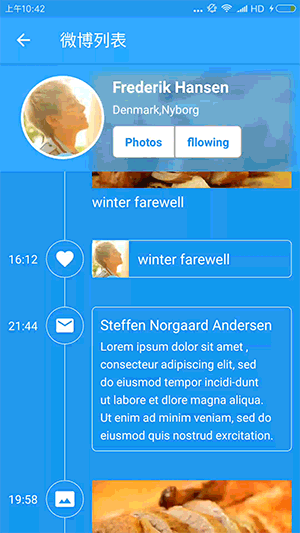

 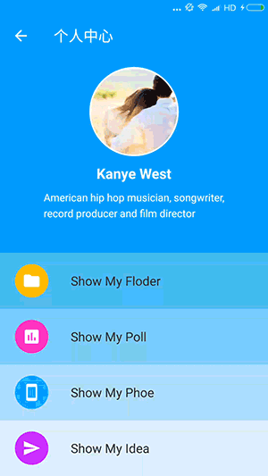

#### 风格演示
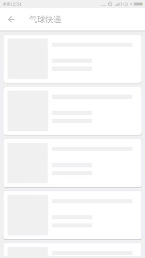 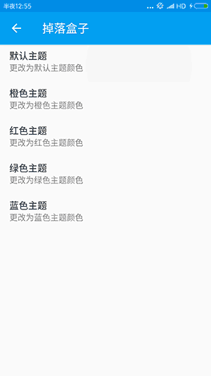

上面这两个是我自己实现的Header，设计来自：[Refresh-your-delivery](https://dribbble.com/shots/2753803-Refresh-your-delivery)，[Dropbox-Refresh](https://dribbble.com/shots/3470499-Dropbox-Refresh)

下面的Header是我把github上其它优秀的Header进行的整理和集合还有优化：

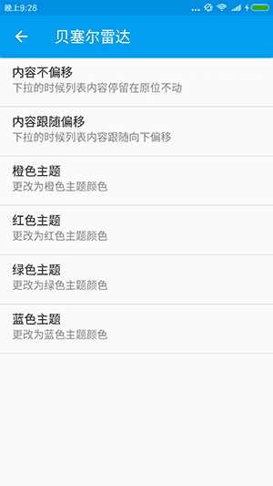 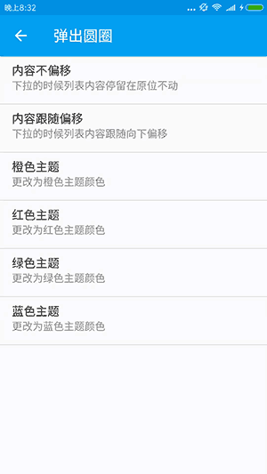

整理来自：[TwinklingRefreshLayout](https://github.com/lcodecorex/TwinklingRefreshLayout/blob/master/art/gif_recyclerview2.gif)，[Pull Down To Refresh](https://dribbble.com/shots/1797373-Pull-Down-To-Refresh)

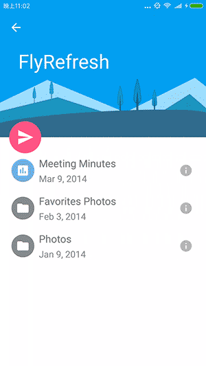 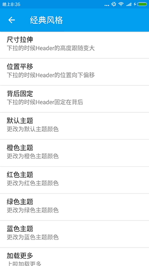

整理来自：[FlyRefresh](https://github.com/race604/FlyRefresh)，[ClassicsHeader](#1)

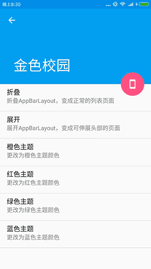 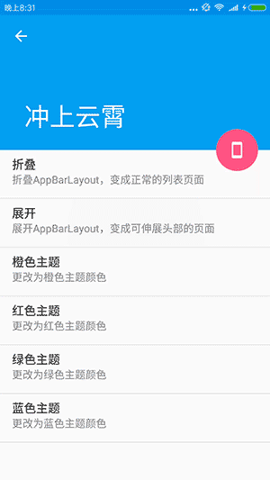

整理来自：[Yalantis/Phoenix](https://github.com/Yalantis/Phoenix)，[Yalantis/Taurus](https://github.com/Yalantis/Taurus)

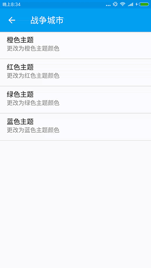 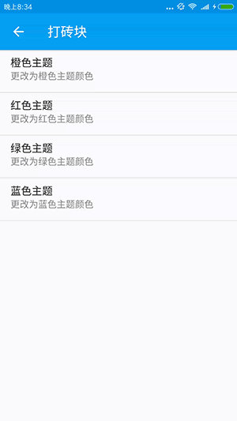

整理来自：[FunGame/BattleCity](https://github.com/Hitomis/FunGameRefresh)，[FunGame/HitBlock](https://github.com/Hitomis/FunGameRefresh)

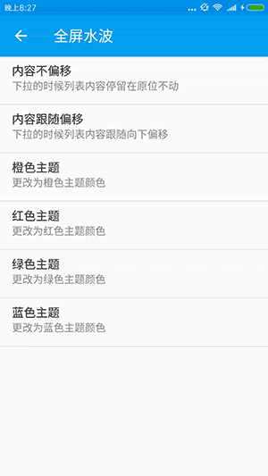 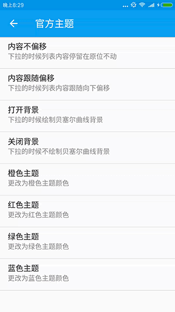

整理来自：[WaveSwipeRefreshLayout](https://github.com/recruit-lifestyle/WaveSwipeRefreshLayout)，[MaterialHeader](https://developer.android.com/reference/android/support/v4/widget/SwipeRefreshLayout.html)

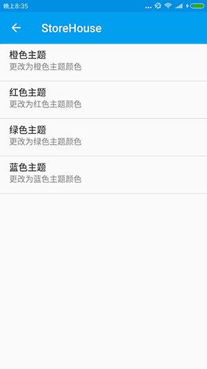 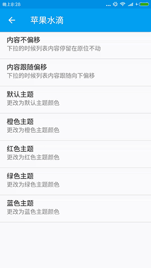

整理来自：[Ultra-Pull-To-Refresh](https://github.com/liaohuqiu/android-Ultra-Pull-To-Refresh)，[WaterDrop](https://github.com/THEONE10211024/WaterDropListView)


看到这么多炫酷的Header，是不是觉得很棒？这时你或许会担心这么多的Header集成在一起，但是平时只会用到一个，是不是要引入很多无用的代码和资源？  
请放心，我已经把刷新布局分成三个包啦，用到的时候自行引用就可以啦！

 - SmartRefreshLayout 刷新布局核心实现，自带ClassicsHeader（经典）、BezierRadarHeader（贝塞尔雷达）两个 Header.
 - SmartRefreshHeader 各种Header的集成，除了Layout自带的Header，其它都在这个包中.
 - SmartRefreshFooter 各种Footer的集成，除了Layout自带的Footer，其它都在这个包中.

## 简单用例
#### 1.在 buld.gradle 中添加依赖
```
compile 'com.android.support:appcompat-v7:25.3.1'//版本随意
compile 'com.scwang.smartrefresh:SmartRefreshLayout:1.0.3'
compile 'com.scwang.smartrefresh:SmartRefreshHeader:1.0.3'//没有使用特殊Header，可以不加这行
```

#### 2.在XML布局文件中添加 SmartRefreshLayout
```xml
<?xml version="1.0" encoding="utf-8"?>
<com.scwang.smartrefresh.layout.SmartRefreshLayout xmlns:android="http://schemas.android.com/apk/res/android"
    android:id="@+id/refreshLayout"
    android:layout_width="match_parent"
    android:layout_height="match_parent">
    <android.support.v7.widget.RecyclerView
        android:id="@+id/recyclerview"
        android:layout_width="match_parent"
        android:layout_height="match_parent"
        android:overScrollMode="never"
        android:background="#fff" />
</com.scwang.smartrefresh.layout.SmartRefreshLayout>
```

#### 3.在 Activity 或者 Fragment 中添加代码
```java
RefreshLayout refreshLayout = (RefreshLayout)findViewById(R.id.refreshLayout);
refreshLayout.setOnRefreshListener(new OnRefreshListener() {
    @Override
    public void onRefresh(RefreshLayout refreshlayout) {
        refreshlayout.finishRefresh(2000);
    }
});
refreshLayout.setOnLoadmoreListener(new OnLoadmoreListener() {
    @Override
    public void onLoadmore(RefreshLayout refreshlayout) {
        refreshlayout.finishLoadmore(2000);
    }
});
```

## 使用指定的 Header 和 Footer

#### 1.方法一 全局设置
```java
public class App extends Application {
    //static 代码段可以防止内存泄露
    static {
        //设置全局的Header构建器
        SmartRefreshLayout.setDefaultRefreshHeaderCreater(new DefaultRefreshHeaderCreater() {
                @Override
                public RefreshHeader createRefreshHeader(Context context, RefreshLayout layout) {
                    layout.setPrimaryColorsId(R.color.colorPrimary, android.R.color.white);//全局设置主题颜色
                    return new ClassicsHeader(context).setSpinnerStyle(SpinnerStyle.Translate);//指定为经典Header，默认是 贝塞尔雷达Header
                }
            });
        //设置全局的Footer构建器
        SmartRefreshLayout.setDefaultRefreshFooterCreater(new DefaultRefreshFooterCreater() {
                @Override
                public RefreshFooter createRefreshFooter(Context context, RefreshLayout layout) {
                    //指定为经典Footer，默认是 BallPulseFooter
                    return new ClassicsFooter(context).setSpinnerStyle(SpinnerStyle.Translate);
                }
            });
    }
}
```

注意：方法一 设置的Header和Footer的优先级是最低的，如果同时还使用了方法二、三，将会被其它方法取代


#### 2.方法二 XML布局文件指定
```xml
<com.scwang.smartrefresh.layout.SmartRefreshLayout
    xmlns:app="http://schemas.android.com/apk/res-auto"
    android:id="@+id/refreshLayout"
    android:layout_width="match_parent"
    android:layout_height="match_parent"
    android:background="#444444"
    app:srlPrimaryColor="#444444"
    app:srlAccentColor="@android:color/white"
    app:srlEnablePreviewInEditMode="true">
    <!--srlAccentColor srlPrimaryColor 将会改变 Header 和 Footer 的主题颜色-->
    <!--srlEnablePreviewInEditMode 可以开启和关闭预览功能-->
    <com.scwang.smartrefresh.layout.header.ClassicsHeader
        android:layout_width="match_parent"
        android:layout_height="wrap_content"/>
    <TextView
        android:layout_width="match_parent"
        android:layout_height="match_parent"
        android:padding="@dimen/padding_common"
        android:background="@android:color/white"
        android:text="@string/description_define_in_xml"/>
    <com.scwang.smartrefresh.layout.footer.ClassicsFooter
        android:layout_width="match_parent"
        android:layout_height="wrap_content"/>
</com.scwang.smartrefresh.layout.SmartRefreshLayout>
```

注意：方法二 XML设置的Header和Footer的优先级是中等的，会被方法三覆盖。而且使用本方法的时候，Android Studio 会有预览效果，如下图：

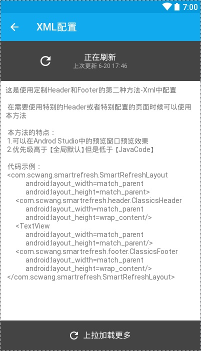

不过不用担心，只是预览效果，运行的时候只有下拉才会出现~

#### 3.方法三 Java代码设置
```java
final RefreshLayout refreshLayout = (RefreshLayout) findViewById(R.id.refreshLayout);
//设置 Header 为 Material风格
refreshLayout.setRefreshHeader(new MaterialHeader(this).setShowBezierWave(true));
//设置 Footer 为 球脉冲
refreshLayout.setRefreshFooter(new BallPulseFooter(this).setSpinnerStyle(SpinnerStyle.Scale));
```

## 混淆

SmartRefreshLayout 没有使用到：序列化、反序列化、JNI、反射，所以并不需要添加混淆过滤代码，并且已经混淆测试通过，如果你在项目的使用中混淆之后出现问题，请及时通知我。

## 赞赏

如果你喜欢 SmartRefreshLayout 的设计，感觉 SmartRefreshLayout 帮助到了你，可以点右上角 "Star" 支持一下 谢谢！ ^_^  
你也还可以扫描下面的二维码~ 请作者喝一杯咖啡。

  

如果在捐赠留言中备注名称，将会被记录到列表中~ 如果你也是github开源作者，捐赠时可以留下github项目地址或者个人主页地址，链接将会被添加到列表中起到互相推广的作用  
[捐赠列表](art/md_donationlist.md)

## 讨论

### QQ解决群 - 602537182 （付费）  
#### 进群须知
自开群以来，还是有很多的朋友提出了很多问题，我也解决了很多问题，其中有大半问题是本库的Bug导致，也有些是使用者项目本
身的环境问题，这花费了我大量的时间，经过我的观察和测试，到目前为止，本库的bug已经越来越少，当然不能说完全没有，但是
已经能满足很大部分项目的需求。所以从现在起，我做出一个决定：把之前的讨论群改成解决群，并开启付费入群功能，专为解决大
家在使用本库时遇到的问题，不管是本库bug还是，特殊的项目环境导致（包含项目本身的bug）。
我也有自己的工作和娱乐时间，只有大家理解和支持我，我才能专心的为大家解决问题。不过用担心，我已经建立了另一个可以免费
进入的QQ讨论群。

### QQ讨论群 - 477963933  
#### 进群须知
这个群，免费进入，大家可以相互讨论本库的相关使用和出现的问题，群主也会在里面解决问题，如果提出的问题，群成员不
能帮助解决，需要群主解决，但是要花费群主五分钟以上的时间（本库Bug除外），群主将不会解决这个问题，如果项目紧急，请付
费进入解决群解决（不过注意，付费群中群主会很认真很努力的解决问题，但也不能保证已经能完美解决）或者转换使用其他的刷新
库。

<!-- 本群专为 【Android智能下拉刷新框架-SmartRefreshLayout】开设，请不要讨论安卓和下拉刷新之外的内容。本群中后期会改为收费解决群，并再开启免费讨论群，还没进群的童鞋赶紧~ -->
#### 温馨提示
加入群的答案在本文档中可以找到~

## 感谢
[SwipeRefreshLayout](https://developer.android.com/reference/android/support/v4/widget/SwipeRefreshLayout.html)  
[TwinklingRefreshLayout](https://github.com/lcodecorex/TwinklingRefreshLayout)  
[Ultra-Pull-To-Refresh](https://github.com/liaohuqiu/android-Ultra-Pull-To-Refresh)  

License
-------

    Copyright 2017 scwang90

    Licensed under the Apache License, Version 2.0 (the "License");
    you may not use this file except in compliance with the License.
    You may obtain a copy of the License at

       http://www.apache.org/licenses/LICENSE-2.0

    Unless required by applicable law or agreed to in writing, software
    distributed under the License is distributed on an "AS IS" BASIS,
    WITHOUT WARRANTIES OR CONDITIONS OF ANY KIND, either express or implied.
    See the License for the specific language governing permissions and
    limitations under the License.
