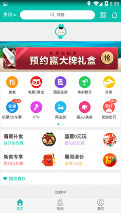
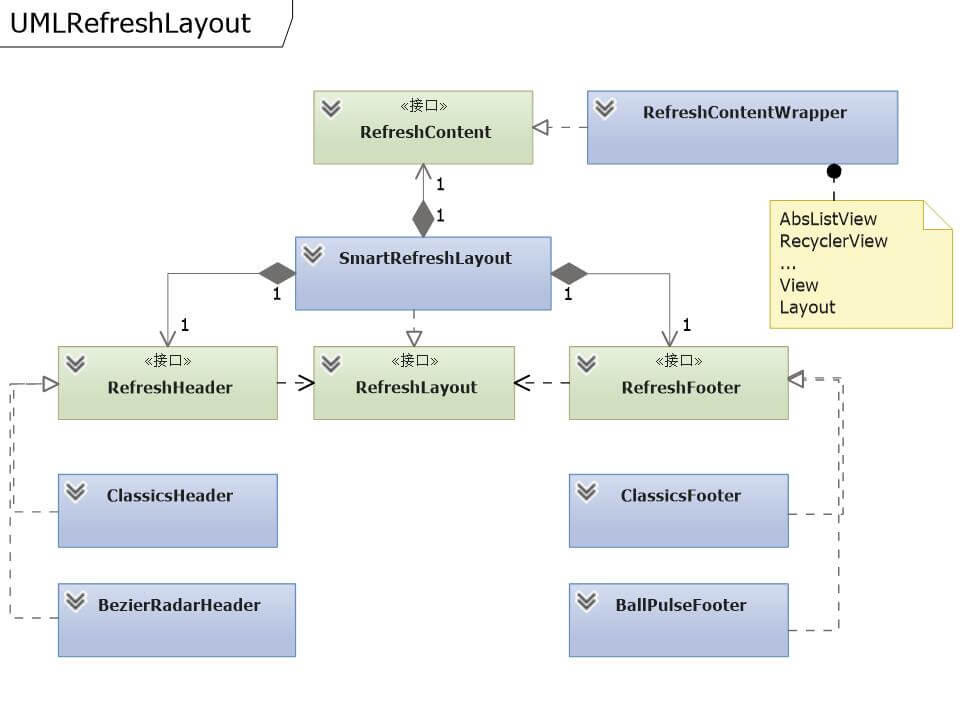

# 自定义Header和Footer

## 把情感化设计的APP卡通形象植入APP界面当中
稍微大一点的互联网公司都有属于自己的企业或app的卡通吉祥物。这些品牌元素都是我们
app设计师发挥创意设计的好素材。 也是需要我们巧妙植入到我们APPui界面设计当中去的
最重要的元素。   
比如美团、饿了吗、天猫。。。

  

## 成功案例

[仿美团下拉刷新](https://www.jianshu.com/p/95225cbcf86b)  
[YanXuanRefresh](https://github.com/ChaserSheng/YanXuanRefresh)  
[SmartRefreshLottie](https://github.com/wapchief/SmartRefreshLottie)  
[一个Android下拉刷新样式](http://www.jianshu.com/p/8f29c97eefd8)  
[838514984](https://github.com/838514984/smartrefreshlayout-statusUtils)

## 安卓下拉刷新框架
SmartRefreshLayout被设计为一个刷新框架，具有非常高的自定性和可扩展性，可以应付
项目中的各种情况和场景。  

通过SmartRefreshLayout框架，你可以在一个稳定强大的下拉布局中实现自己项目需求的
Header ，不用去关心滑动事件处理，不用关心子控件的回弹和滚动边界，只需关注自己真
正的项目需求Header的样子和动画。

### 体系结构
在学习使用框架的自定义功能之前，我们还是有必要来了解一下框架的体系和结构：

 - **RefreshLayout** 下拉的基本功能，包括布局测量、滑动事件处理、参数设定等等
 - **RefreshHeader** 下拉头部的事件处理和显示接口
 - **RefreshFooter** 上拉底部的事件处理和显示接口
 - **RefreshContent** 对不同内容的统一封装，包括判断是否可滚动、回弹判断、智能识别

下面是UML关系类图

### 优势特点
网上其他的开源下拉控件一样的可以自定义 Header 和 Footer ，SmartRefreshLayout 和它们
比起来有什么优势？

#### 变换方式

- **Translate 平行移动**  特点: 最常见，HeaderView高度不会改变，
- **Scale 拉伸形变**  特点：在下拉和上弹（HeaderView高度改变）时候，会自动触发OnDraw事件
- **FixedFront 固定在前面**   特点：不会上下移动，HeaderView高度不会改变
- **FixedBehind 固定在后面**  特点：不会上下移动，HeaderView高度不会改变（类似微信浏览器效果）
- **Screen 全屏幕** 特点：固定在前面，尺寸充满整个布局

SmartRefreshLayout 的Header和Footer都有多种变换方式，适应不同风格的 Header 和 Footer，下面是不同变换方式Header的Demo

**FixedBehind 固定在后面** 和 **Scale 拉伸形变**

 

**Screen 全屏幕** 和 **Translate 平行移动**

 

#### 独立事件
Header和Footer 可以独立的处理手指滑动事件来为动画提供操作指令，也可以使用RefreshLayout的核心接口来完成一些不寻常的操作指令。
下面的打砖块 Header中 ，Header可以独立的使用滑动事件来为游戏挡板提供指令，并同时可以调用核心接口来通知RefreshLayout上下滚动列表

 

### RefreshHeader接口

实现自定义Header的第一步就是实现RefreshHeader接口，我们来看看RefreshHeader接口的定义和详细说明

~~~java
public interface RefreshHeader {
    /**
     * 获取真实视图（必须返回，不能为null）
     */
    @NonNull
    View getView();

    /**
     * 获取变换方式（必须指定一个：平移、拉伸、固定、全屏）
     */
    SpinnerStyle getSpinnerStyle();

    /**
     * 设置主题颜色 （如果自定义的Header没有注意颜色，本方法可以什么都不处理）
     * @param colors 对应Xml中配置的 srlPrimaryColor srlAccentColor
     */
    void setPrimaryColors(@ColorInt int ... colors);

    /**
     * 尺寸定义初始化完成 （如果高度不改变（代码修改：setHeader），只调用一次, 在RefreshLayout#onMeasure中调用）
     * @param kernel RefreshKernel 核心接口（用于完成高级Header功能）
     * @param height HeaderHeight or FooterHeight
     * @param extendHeight extendHeaderHeight or extendFooterHeight
     */
    void onInitialized(RefreshKernel kernel, int height, int extendHeight);

    /**
     * 开始动画（开始刷新或者开始加载动画）
     * @param layout RefreshLayout
     * @param height HeaderHeight or FooterHeight
     * @param extendHeight extendHeaderHeight or extendFooterHeight
     */
    void onStartAnimator(RefreshLayout layout, int height, int extendHeight);

    /**
     * 动画结束
     * @param layout RefreshLayout
     * @param success 数据是否成功刷新或加载
     * @return 完成动画所需时间 如果返回 Integer.MAX_VALUE 将取消本次完成事件，继续保持原有状态
     */
    int onFinish(RefreshLayout layout, boolean success);

    /**
     * 手指拖动下拉（会连续多次调用，用于实时控制动画关键帧）
     * @param percent 下拉的百分比 值 = offset/headerHeight (0 - percent - (headerHeight+extendHeight) / headerHeight )
     * @param offset 下拉的像素偏移量  0 - offset - (headerHeight+extendHeight)
     * @param headerHeight Header的高度
     * @param extendHeight Header的扩展高度
     */
    void onPulling(float percent, int offset, int headerHeight, int extendHeight);

    /**
     * 手指释放之后的持续动画（会连续多次调用，用于实时控制动画关键帧）
     * @param percent 下拉的百分比 值 = offset/headerHeight (0 - percent - (headerHeight+extendHeight) / headerHeight )
     * @param offset 下拉的像素偏移量  0 - offset - (headerHeight+extendHeight)
     * @param headerHeight Header的高度
     * @param extendHeight Header的扩展高度
     */
    void onReleasing(float percent, int offset, int headerHeight, int extendHeight);
}
~~~

### 实现 RefreshHeader

接下来我们通过实现一个最简单的经典Header（没有更新时间），来慢慢了解自定义Header的流程。

#### 需求分析
我们的经典Header需要一个标题文本、刷新动画、下拉箭头。由此我们可以选定一个继承LinearLayout并列出成员变量

~~~java
public class ClassicsHeader extends LinearLayout implements RefreshHeader {

    private TextView mHeaderText;//标题文本
    private PathsView mArrowView;//下拉箭头
    private ImageView mProgressView;//刷新动画视图
    private ProgressDrawable mProgressDrawable;//刷新动画

    public ClassicsHeader(Context context) {
        super(context);
        setGravity(Gravity.CENTER_HORIZONTAL);
        mHeaderText = new TextView(context);
        mProgressDrawable = new ProgressDrawable();
        mArrowView = new PathsView(context);
        mProgressView = new ImageView(context);
        mProgressView.setImageDrawable(mProgressDrawable);
        addView(mProgressView);
        addView(mArrowView, lpProgress);
        addView(mHeaderText, lpHeaderText);
    }
}
~~~

#### 指定样式
根据我们的常识，经典Header在下拉的时候是贴着列表平移向下冒出，所以我们实现样式直接指定为：平移

~~~java
public class ClassicsHeader extends LinearLayout implements RefreshHeader {
    @NonNull
    public View getView() {
        return this;//真实的视图就是自己，不能返回null
    }
    @Override
    public SpinnerStyle getSpinnerStyle() {
        return SpinnerStyle.Translate;//指定为平移，不能null
    }
}
~~~

#### 动画开关
接下来我们需要在关键地方对动画进行控制和开启

~~~java
public class ClassicsHeader extends LinearLayout implements RefreshHeader {
    @Override
    public void onStartAnimator(RefreshLayout layout, int headHeight, int extendHeight) {
        mProgressDrawable.start();//开始动画
    }
    @Override
    public int onFinish(RefreshLayout layout, boolean success) {
        mProgressDrawable.stop();//停止动画
        if (success){
            mHeaderText.setText("刷新完成");
        } else {
            mHeaderText.setText("刷新失败");        
        }
        return 500;//延迟500毫秒之后再弹回
    }
}
~~~

#### 状态控制
我们还要在不同的状态控制内部控件的显示和旋转

~~~java
public class ClassicsHeader extends LinearLayout implements RefreshHeader {
    @Override
    public void onStateChanged(RefreshLayout refreshLayout, RefreshState oldState, RefreshState newState) {
        switch (newState) {
            case None:
            case PullDownToRefresh:
                mHeaderText.setText("下拉开始刷新");
                mArrowView.setVisibility(VISIBLE);//显示下拉箭头
                mProgressView.setVisibility(GONE);//隐藏动画
                mArrowView.animate().rotation(0);//还原箭头方向
                break;
            case Refreshing:
                mHeaderText.setText("正在刷新");
                mProgressView.setVisibility(VISIBLE);//显示加载动画
                mArrowView.setVisibility(GONE);//隐藏箭头
                break;
            case ReleaseToRefresh:
                mHeaderText.setText("释放立即刷新");
                mArrowView.animate().rotation(180);//显示箭头改为朝上
                break;
        }
    }
}
~~~

#### 最后整合
虽然接口的其他方法我们不用特意去实现，但是方法体还是要声明一下，整合之后完整的代码如下：

~~~java
public class ClassicsHeader extends LinearLayout implements RefreshHeader {

    private TextView mHeaderText;//标题文本
    private PathsView mArrowView;//下拉箭头
    private ImageView mProgressView;//刷新动画视图
    private ProgressDrawable mProgressDrawable;//刷新动画

    public ClassicsHeader(Context context) {
        super(context);
        initView(context);
    }
    public ClassicsHeader(Context context, AttributeSet attrs) {
        super(context, attrs);
        this.initView(context);
    }
    public ClassicsHeader(Context context, AttributeSet attrs, int defStyleAttr) {
        super(context, attrs, defStyleAttr);
        this.initView(context);
    }
    private void initView(Context context) {
        setGravity(Gravity.CENTER);
        mHeaderText = new TextView(context);
        mProgressDrawable = new ProgressDrawable();
        mArrowView = new PathsView(context);
        mProgressView = new ImageView(context);
        mProgressView.setImageDrawable(mProgressDrawable);
        mArrowView.parserPaths("M20,12l-1.41,-1.41L13,16.17V4h-2v12.17l-5.58,-5.59L4,12l8,8 8,-8z");
        addView(mProgressView, DensityUtil.dp2px(20), DensityUtil.dp2px(20));
        addView(mArrowView, DensityUtil.dp2px(20), DensityUtil.dp2px(20));
        addView(new View(context), DensityUtil.dp2px(20), DensityUtil.dp2px(20));
        addView(mHeaderText, LayoutParams.WRAP_CONTENT, LayoutParams.WRAP_CONTENT);
        setMinimumHeight(DensityUtil.dp2px(60));
    }
    @NonNull
    public View getView() {
        return this;//真实的视图就是自己，不能返回null
    }
    @Override
    public SpinnerStyle getSpinnerStyle() {
        return SpinnerStyle.Translate;//指定为平移，不能null
    }
    @Override
    public void onStartAnimator(RefreshLayout layout, int headHeight, int extendHeight) {
        mProgressDrawable.start();//开始动画
    }
    @Override
    public int onFinish(RefreshLayout layout, boolean success) {
        mProgressDrawable.stop();//停止动画
        if (success){
            mHeaderText.setText("刷新完成");
        } else {
            mHeaderText.setText("刷新失败");
        }
        return 500;//延迟500毫秒之后再弹回
    }
    @Override
    public void onStateChanged(RefreshLayout refreshLayout, RefreshState oldState, RefreshState newState) {
        switch (newState) {
            case None:
            case PullDownToRefresh:
                mHeaderText.setText("下拉开始刷新");
                mArrowView.setVisibility(VISIBLE);//显示下拉箭头
                mProgressView.setVisibility(GONE);//隐藏动画
                mArrowView.animate().rotation(0);//还原箭头方向
                break;
            case Refreshing:
                mHeaderText.setText("正在刷新");
                mProgressView.setVisibility(VISIBLE);//显示加载动画
                mArrowView.setVisibility(GONE);//隐藏箭头
                break;
            case ReleaseToRefresh:
                mHeaderText.setText("释放立即刷新");
                mArrowView.animate().rotation(180);//显示箭头改为朝上
                break;
        }
    }
    @Override
    public boolean isSupportHorizontalDrag() {
        return false;
    }
    @Override
    public void onInitialized(RefreshKernel kernel, int height, int extendHeight) {
    }
    @Override
    public void onHorizontalDrag(float percentX, int offsetX, int offsetMax) {
    }
    @Override
    public void onPulling(float percent, int offset, int headHeight, int extendHeight) {
    }
    @Override
    public void onReleasing(float percent, int offset, int headHeight, int extendHeight) {
    }
    @Override
    public void onRefreshReleased(RefreshLayout layout, int headerHeight, int extendHeight) {
    }
    @Override
    public void setPrimaryColors(@ColorInt int ... colors){
    }
}
~~~

### 实现 RefreshFooter

具体方法和 RefreshHeader 非常相似，这里就不再演示了
